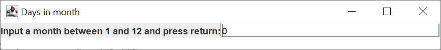

# Days in Month Report
Author: Melissa Liao

## UML class diagram

## Execution and Testing

**Testing `Days` class**

**Days in Month GUI Usage**
1. First, input the number of the month at the white bar (shown zero as default).

2. Once you put in a number, press your ENTER or RETURN keyboard.

3. Lastly, number of days for the month you chose will be output in text area.

